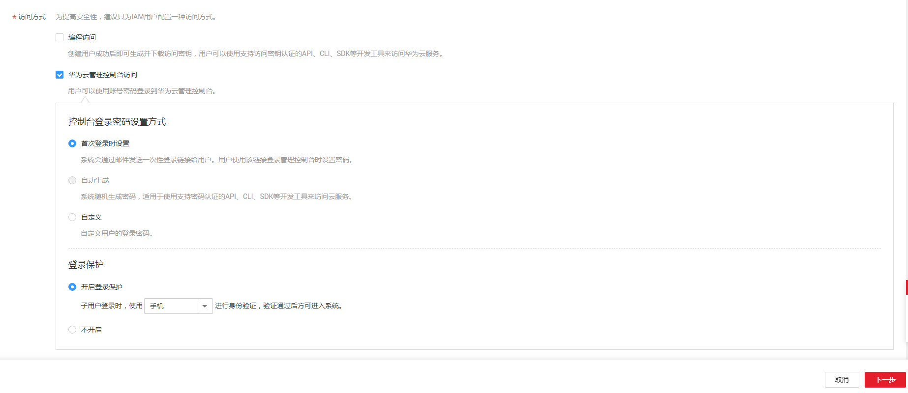

# 创建IAM用户

如果您是[管理员](使用前必读.md#section209491111991)，在华为云购买了多种资源，例如弹性云服务器、云硬盘、裸金属服务器等，您需要将资源分配给企业中不同的员工或者应用程序使用，为了避免分享自己的账号密码，您可以使用IAM的用户管理功能，给员工或应用程序创建IAM用户。

默认情况下，**新创建的IAM用户没有任何权限**，管理员需要将其加入用户组，并给[用户组授权](创建用户组并授权.md)，用户组中的用户将获得用户组的权限。授权后，IAM用户就可以基于权限对云服务进行操作。

“admin”为华为云缺省提供的用户组，具有所有云服务资源的操作权限。将用户加入该用户组后，用户可以操作并使用所有云服务资源，包括但不仅限于创建用户组及用户、修改用户组权限、管理华为云资源等。

## 操作步骤

1.  登录华为云，在右上角单击“控制台”。

    

2.  在控制台页面，鼠标移动至右上方的用户名，在下拉列表中选择“统一身份认证”。

    

3.  在统一身份认证服务，左侧导航窗格中，单击“用户”\>“创建用户”。
4.  在“创建用户”页面填写“用户信息”。如需一次创建多个用户，可以单击“添加用户”进行批量创建，每次最多可创建10个用户。

    **图 1**  配置用户信息  
    

    **表 1**  用户信息

    
    <table><thead align="left"><tr id="row1585971132215"><th class="cellrowborder" valign="top" width="7.870000000000001%" id="mcps1.2.3.1.1">
用户信息

    </th>
    <th class="cellrowborder" valign="top" width="92.13%" id="mcps1.2.3.1.2">
说明

    </th>
    </tr>
    </thead>
    <tbody><tr id="row148161516192520"><td class="cellrowborder" valign="top" width="7.870000000000001%" headers="mcps1.2.3.1.1 ">
用户名

    </td>
    <td class="cellrowborder" valign="top" width="92.13%" headers="mcps1.2.3.1.2 ">
必填。IAM用户登录华为云的用户名，此处以“James”和“Alice”为例。

    </td>
    </tr>
    <tr id="row138598110225"><td class="cellrowborder" valign="top" width="7.870000000000001%" headers="mcps1.2.3.1.1 ">
邮箱

    </td>
    <td class="cellrowborder" valign="top" width="92.13%" headers="mcps1.2.3.1.2 ">
“访问方式”选择“首次登录时设置”时必填，选择其他时选填。IAM用户绑定的邮箱，可作为子账户的登录凭证，也可由IAM用户自己绑定。

    </td>
    </tr>
    <tr id="row58605162217"><td class="cellrowborder" valign="top" width="7.870000000000001%" headers="mcps1.2.3.1.1 ">
手机号

    </td>
    <td class="cellrowborder" valign="top" width="92.13%" headers="mcps1.2.3.1.2 ">
选填。IAM用户绑定的手机号，可作为子账户的登录凭证，也可由IAM用户自己绑定。

    </td>
    </tr>
    <tr id="row7386153642217"><td class="cellrowborder" valign="top" width="7.870000000000001%" headers="mcps1.2.3.1.1 ">
描述

    </td>
    <td class="cellrowborder" valign="top" width="92.13%" headers="mcps1.2.3.1.2 ">
选填。记录IAM用户相关信息。

    </td>
    </tr>
    </tbody>
    </table>

5.  在“创建用户”页面选择“访问方式”，完成后单击“下一步”。

    **图 2**  配置访问方式  
    

    **表 2**  访问方式

    
    <table><thead align="left"><tr id="row8779161802313"><th class="cellrowborder" valign="top" id="mcps1.2.5.1.1">
访问方式

    </th>
    <th class="cellrowborder" colspan="2" valign="top" id="mcps1.2.5.1.2">
配置信息

    </th>
    <th class="cellrowborder" valign="top" id="mcps1.2.5.1.3">
说明

    </th>
    </tr>
    </thead>
    <tbody><tr id="row10564326122520"><td class="cellrowborder" rowspan="5" valign="top" width="16.03839616038396%" headers="mcps1.2.5.1.1 ">
华为云管理控制台访问

    
&nbsp;&nbsp;

    
&nbsp;&nbsp;

    
&nbsp;&nbsp;

    </td>
    <td class="cellrowborder" rowspan="3" valign="top" width="11.848815118488151%" headers="mcps1.2.5.1.2 ">
控制台登录密码设置方式

    
&nbsp;&nbsp;

    </td>
    <td class="cellrowborder" valign="top" width="12.248775122487752%" headers="mcps1.2.5.1.2 ">
首次登录时设置

    </td>
    <td class="cellrowborder" valign="top" width="59.86401359864014%" headers="mcps1.2.5.1.3 ">
如果您不是用户James的使用主体，建议您选择该方式，输入用户的邮箱和手机，用户James通过邮件中的一次性链接登录华为云，自行设置密码。

    </td>
    </tr>
    <tr id="row10205744184711"><td class="cellrowborder" valign="top" headers="mcps1.2.5.1.1 ">
自动生成

    </td>
    <td class="cellrowborder" valign="top" headers="mcps1.2.5.1.2 ">
仅在创建单个用户时适用，如果您本次创建2个及以上的用户，则不支持此方式。

    </td>
    </tr>
    <tr id="row17779418132313"><td class="cellrowborder" valign="top" headers="mcps1.2.5.1.1 ">
自定义

    </td>
    <td class="cellrowborder" valign="top" headers="mcps1.2.5.1.2 ">
如果您是用户James的使用主体，建议您选择该方式，设置自己的登录密码。

    </td>
    </tr>
    <tr id="row18624110123516"><td class="cellrowborder" rowspan="2" valign="top" headers="mcps1.2.5.1.1 ">
登录保护

    
&nbsp;&nbsp;

    </td>
    <td class="cellrowborder" valign="top" headers="mcps1.2.5.1.2 ">
开启登录保护

    </td>
    <td class="cellrowborder" valign="top" headers="mcps1.2.5.1.2 ">
开启登录保护后，IAM用户登录时，除了在登录页面输入用户名和密码外（第一次身份验证），还需要在登录验证页面输入验证码（第二次身份验证），该功能是一种安全实践，建议开启登录保护，多次身份认证可以提高账号安全性。

    
您可以选择通过手机、邮箱、虚拟MFA进行登录验证。

    </td>
    </tr>
    <tr id="row5127153713351"><td class="cellrowborder" valign="top" headers="mcps1.2.5.1.1 ">
不开启

    </td>
    <td class="cellrowborder" valign="top" headers="mcps1.2.5.1.2 ">
创建完成后，如需开启登录保护，请参见：<a href="敏感操作.md#zh-cn_topic_0176803437_section6465133820464">登录保护</a>。

    </td>
    </tr>
    <tr id="row177991813236"><td class="cellrowborder" valign="top" width="16.03839616038396%" headers="mcps1.2.5.1.1 ">
编程访问

    </td>
    <td class="cellrowborder" valign="top" width="11.848815118488151%" headers="mcps1.2.5.1.2 ">
--

    </td>
    <td class="cellrowborder" valign="top" width="12.248775122487752%" headers="mcps1.2.5.1.2 ">
--

    </td>
    <td class="cellrowborder" valign="top" width="59.86401359864014%" headers="mcps1.2.5.1.3 ">
创建用户完成后即可下载本次创建的所有用户的<a href="https://support.huaweicloud.com/usermanual-ca/ca_01_0003.html" target="_blank" rel="noopener noreferrer">访问密钥（AK/SK）</a>。一个用户最多拥有两个访问密钥。这些AK/SK可以对华为云进行编程调用，例如，通过API调用方式访问华为云时，您可能需要使用访问密钥。

    </td>
    </tr>
    </tbody>
    </table>

    > **说明：**   
    >-   用户可以使用此处设置的用户名、邮箱或手机号码任意一种方式登录华为云。  
    >-   当用户忘记密码时，可以通过此处绑定的邮箱或手机自行重置密码，如果用户没有绑定邮箱或手机号码，只能由管理员重置密码。  
    >-   用户登录系统时，输入用户名和初始密码后，将进入“首次登录修改密码”，需要创建一个新密码，该功能可以保证用户的密码是由使用者本人所设置，防止密码泄露。  

6.  单击“下一步”，将用户加入到用户组（可选）。

    -   将用户加入用户组，用户将具备用户组的权限，这一过程即给用户授权。
    -   如需创建新的用户组，可单击“创建用户组”，填写用户组名称和描述（可选），创建成功后即可将用户加入到新创建的用户组中。

    > **说明：**   
    >-   如果该用户是管理员，可以将用户加入默认用户组“admin”中。  
    >-   一个用户可以同时加入多个用户组。  

7.  单击“下一步”，IAM用户创建完成，用户列表中显示新创建的IAM用户。如果[表2 访问方式](#table1777851811233)勾选了“编程访问”，可在此页面下载访问密钥。

    

