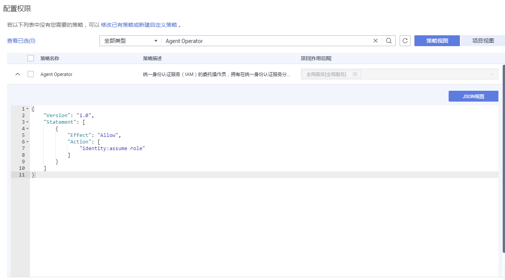
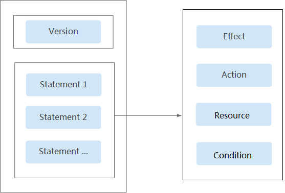
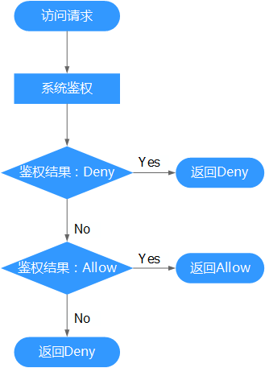

# 策略<a name="iam_01_0017"></a>

开通基于策略的访问控制公测后，在“统一身份认证“页面的左侧导航树单击“权限“，可以查看**[系统权限](https://support.huaweicloud.com/usermanual-permissions/iam_01_0001.html)**和自定义策略。

## 策略内容<a name="section661112662719"></a>

给用户组选择策略时，单击策略前面的，可以查看策略的详细内容，以“Agent Operator”为例。



**作用范围**：给用户组授予该策略时，选择的授权区域。

-   全局服务：服务部署时不区分物理区域，为全局级服务。在全局项目中进行授权，访问该服务时，不需要切换区域。包括对象存储服务（OBS）、内容分发网络（CDN）、标签管理服务（TMS）等。
-   项目级服务：服务部署时通过物理区域划分，为项目级服务。**在除全局区域外的其他区域中授权**，并且只在授权区域生效，如果需要所有区域都生效，则所有区域都需要进行授权操作,，例如弹性云服务器（ECS）。IAM用户访问该服务时，需要先切换到授权区域。

全局级服务/项目级服务：服务部署在所有区域，在所有区域中都可以授权，例如SSL证书管理（SCM）。

## 策略结构<a name="section547017479502"></a>

策略结构包括：Version（策略版本号）和Statement（策略权限语句），其中Statement可以有多个，表示不同的授权项。

**图 1**  策略结构<a name="fig5883114715499"></a>  


## 策略内容<a name="zh-cn_topic_0165292618_section9359105292516"></a>

以“OBS Viewer”为例，说明策略的语法。

```
{
        "Version": "1.1",
        "Statement": [
                {
                        "Effect": "Allow",
                        "Action": [
                                "obs:bucket:ListAllMybuckets",
                                "obs:bucket:HeadBucket",
                                "obs:bucket:ListBucket",
                                "obs:bucket:GetBucketLocation",
                        ],
                        "Condition": {
                                "StringEndWithIfExsits": {
                                       "g:UserName": [
                                               "specialCharactor"
                                       ]
                                },
                                "Bool": {
                                       "g:MFAPresent": [
                                               "true"
                                       ]
                                }
                        },
                        "Resource": [
                                "obs:*:*:bucket:*"
                        ]
                }
        ]
}
```

**表 1**  参数说明

<a name="table263109993745"></a>
<table><thead align="left"><tr id="row5964380593745"><th class="cellrowborder" colspan="2" valign="top" id="mcps1.2.5.1.1"><p id="p3840680793745"><a name="p3840680793745"></a><a name="p3840680793745"></a>参数</p>
</th>
<th class="cellrowborder" valign="top" id="mcps1.2.5.1.2"><p id="p2394366493745"><a name="p2394366493745"></a><a name="p2394366493745"></a>含义</p>
</th>
<th class="cellrowborder" valign="top" id="mcps1.2.5.1.3"><p id="p6038866693745"><a name="p6038866693745"></a><a name="p6038866693745"></a>值</p>
</th>
</tr>
</thead>
<tbody><tr id="row33603866145041"><td class="cellrowborder" colspan="2" valign="top" headers="mcps1.2.5.1.1 "><p id="p6202570314511"><a name="p6202570314511"></a><a name="p6202570314511"></a>Version</p>
</td>
<td class="cellrowborder" valign="top" headers="mcps1.2.5.1.2 "><p id="p5802604114511"><a name="p5802604114511"></a><a name="p5802604114511"></a>策略的版本</p>
</td>
<td class="cellrowborder" valign="top" headers="mcps1.2.5.1.3 "><p id="p15309210213"><a name="p15309210213"></a><a name="p15309210213"></a>1.1：策略</p>
</td>
</tr>
<tr id="row3390115193745"><td class="cellrowborder" rowspan="4" valign="top" width="8.309999999999999%" headers="mcps1.2.5.1.1 "><p id="p2571453445"><a name="p2571453445"></a><a name="p2571453445"></a>Statement：</p>
<p id="p4120437893745"><a name="p4120437893745"></a><a name="p4120437893745"></a>策略的授权语句</p>
<p id="p10610185716507"><a name="p10610185716507"></a><a name="p10610185716507"></a>&nbsp;&nbsp;</p>
<p id="p15875104510117"><a name="p15875104510117"></a><a name="p15875104510117"></a>&nbsp;&nbsp;</p>
</td>
<td class="cellrowborder" valign="top" width="10.63%" headers="mcps1.2.5.1.1 "><p id="p15225242142620"><a name="p15225242142620"></a><a name="p15225242142620"></a>Action：授权项</p>
</td>
<td class="cellrowborder" valign="top" width="31.869999999999997%" headers="mcps1.2.5.1.2 "><p id="p22261942112610"><a name="p22261942112610"></a><a name="p22261942112610"></a>操作权限</p>
</td>
<td class="cellrowborder" valign="top" width="49.19%" headers="mcps1.2.5.1.3 "><p id="p22471177492"><a name="p22471177492"></a><a name="p22471177492"></a>格式为：服务名:资源类型:操作，支持通配符号*，通配符号*表示所有。</p>
<p id="zh-cn_topic_0165292618_p153981591216"><a name="zh-cn_topic_0165292618_p153981591216"></a><a name="zh-cn_topic_0165292618_p153981591216"></a>示例：</p>
<a name="ul1035712231320"></a><a name="ul1035712231320"></a><ul id="ul1035712231320"><li>"obs:bucket:ListAllMybuckets"：表示查看OBS桶列表权限，其中obs为服务名，bucket为资源类型，ListAllMybuckets为操作。</li></ul>
</td>
</tr>
<tr id="row14410123292620"><td class="cellrowborder" valign="top" headers="mcps1.2.5.1.1 "><p id="p154997388265"><a name="p154997388265"></a><a name="p154997388265"></a>Effect：作用</p>
</td>
<td class="cellrowborder" valign="top" headers="mcps1.2.5.1.1 "><p id="p1043912593493"><a name="p1043912593493"></a><a name="p1043912593493"></a>定义Action中的操作权限是否允许执行。</p>
</td>
<td class="cellrowborder" valign="top" headers="mcps1.2.5.1.2 "><a name="ul10506203862610"></a><a name="ul10506203862610"></a><ul id="ul10506203862610"><li>Allow：允许执行。</li><li>Deny：不允许执行。</li></ul>
<div class="note" id="note273204052719"><a name="note273204052719"></a><a name="note273204052719"></a><span class="notetitle"> 说明： </span><div class="notebody"><p id="p1074104019279"><a name="p1074104019279"></a><a name="p1074104019279"></a>当同一个Action的Effect既有Allow又有Deny时，遵循Deny优先的原则。</p>
</div></div>
</td>
</tr>
<tr id="row7609057135016"><td class="cellrowborder" valign="top" headers="mcps1.2.5.1.1 "><p id="p186101757125011"><a name="p186101757125011"></a><a name="p186101757125011"></a>Resource: 资源类型</p>
</td>
<td class="cellrowborder" valign="top" headers="mcps1.2.5.1.1 "><p id="p1861015795018"><a name="p1861015795018"></a><a name="p1861015795018"></a>策略所作用的资源</p>
</td>
<td class="cellrowborder" valign="top" headers="mcps1.2.5.1.2 "><p id="p166105579508"><a name="p166105579508"></a><a name="p166105579508"></a>格式为：服务名:region:domainId:资源类型:资源路径, 通配符号*表示所有。</p>
<p id="p6110183817129"><a name="p6110183817129"></a><a name="p6110183817129"></a>示例：</p>
<a name="ul131025314178"></a><a name="ul131025314178"></a><ul id="ul131025314178"><li>"obs:*:*:bucket:*": 表示所有的OBS桶。</li><li>"obs:*:*:object:my-bucket/my-object/*": 表示my-bucket桶my-object目录下的所有对象。</li></ul>
</td>
</tr>
<tr id="row158753451710"><td class="cellrowborder" valign="top" headers="mcps1.2.5.1.1 "><p id="p1487584515113"><a name="p1487584515113"></a><a name="p1487584515113"></a>Condition: 条件</p>
</td>
<td class="cellrowborder" valign="top" headers="mcps1.2.5.1.1 "><p id="p168751145615"><a name="p168751145615"></a><a name="p168751145615"></a>使策略生效的特定条件，包括条件键和运算符。条件键表示策略语句的 Condition 元素中的键值，分为<a href="#table5817133903114">全局级条件键</a>和服务级条件键（由云服务定义，请参见云服务帮助中心）。全局级条件键（前缀为g:）适用于所有操作，服务级条件键（前缀为服务缩写，如obs:）仅适用于对应服务的操作。运算符与条件键一起使用，构成完整的条件判断语句。</p>
</td>
<td class="cellrowborder" valign="top" headers="mcps1.2.5.1.2 "><p id="p587513451712"><a name="p587513451712"></a><a name="p587513451712"></a>格式为：条件运算符: {条件名：[条件值1, 条件值2]}。</p>
<p id="p1331219285408"><a name="p1331219285408"></a><a name="p1331219285408"></a>示例:</p>
<a name="ul1460613818112"></a><a name="ul1460613818112"></a><ul id="ul1460613818112"><li>"StringEndWithIfExists":{"g:UserName":["specialCharactor"]}：表示当用户输入的用户名以"specialCharactor"结尾时该条statement生效。</li></ul>
</td>
</tr>
</tbody>
</table>

全局条件键参考如下：

**表 2**  全局级请求条件

<a name="table5817133903114"></a>
<table><thead align="left"><tr id="row58181139183115"><th class="cellrowborder" valign="top" width="33.33333333333333%" id="mcps1.2.4.1.1"><p id="p20818153911316"><a name="p20818153911316"></a><a name="p20818153911316"></a>全局条件键</p>
</th>
<th class="cellrowborder" valign="top" width="9.550955095509552%" id="mcps1.2.4.1.2"><p id="p189831506545"><a name="p189831506545"></a><a name="p189831506545"></a>条件类型</p>
</th>
<th class="cellrowborder" valign="top" width="57.11571157115712%" id="mcps1.2.4.1.3"><p id="p18818339133116"><a name="p18818339133116"></a><a name="p18818339133116"></a>说明</p>
</th>
</tr>
</thead>
<tbody><tr id="row1981833993110"><td class="cellrowborder" valign="top" width="33.33333333333333%" headers="mcps1.2.4.1.1 "><p id="p59903284566"><a name="p59903284566"></a><a name="p59903284566"></a>g:CurrentTime</p>
</td>
<td class="cellrowborder" valign="top" width="9.550955095509552%" headers="mcps1.2.4.1.2 "><p id="p1181853903116"><a name="p1181853903116"></a><a name="p1181853903116"></a>时间</p>
</td>
<td class="cellrowborder" valign="top" width="57.11571157115712%" headers="mcps1.2.4.1.3 "><p id="p88191139183117"><a name="p88191139183117"></a><a name="p88191139183117"></a>接收到鉴权请求的时间。以 ISO 8601 格式表示，例如：2012-11-11T23:59:59Z。</p>
</td>
</tr>
<tr id="row14174174353113"><td class="cellrowborder" valign="top" width="33.33333333333333%" headers="mcps1.2.4.1.1 "><p id="p11751143153118"><a name="p11751143153118"></a><a name="p11751143153118"></a>g:DomainName</p>
</td>
<td class="cellrowborder" valign="top" width="9.550955095509552%" headers="mcps1.2.4.1.2 "><p id="p4175184319318"><a name="p4175184319318"></a><a name="p4175184319318"></a>字符串</p>
</td>
<td class="cellrowborder" valign="top" width="57.11571157115712%" headers="mcps1.2.4.1.3 "><p id="p12175943133118"><a name="p12175943133118"></a><a name="p12175943133118"></a>华为云账号名称</p>
</td>
</tr>
<tr id="row781833923113"><td class="cellrowborder" valign="top" width="33.33333333333333%" headers="mcps1.2.4.1.1 "><p id="p9818193903118"><a name="p9818193903118"></a><a name="p9818193903118"></a>g:MFAPresent</p>
</td>
<td class="cellrowborder" valign="top" width="9.550955095509552%" headers="mcps1.2.4.1.2 "><p id="p481883918319"><a name="p481883918319"></a><a name="p481883918319"></a>布尔值</p>
</td>
<td class="cellrowborder" valign="top" width="57.11571157115712%" headers="mcps1.2.4.1.3 "><p id="p2465122012"><a name="p2465122012"></a><a name="p2465122012"></a>是否使用MFA多因素认证方式获取Token</p>
</td>
</tr>
<tr id="row8818739103110"><td class="cellrowborder" valign="top" width="33.33333333333333%" headers="mcps1.2.4.1.1 "><p id="p02819137575"><a name="p02819137575"></a><a name="p02819137575"></a>g:ProjectName</p>
</td>
<td class="cellrowborder" valign="top" width="9.550955095509552%" headers="mcps1.2.4.1.2 "><p id="p3818839143117"><a name="p3818839143117"></a><a name="p3818839143117"></a>字符串</p>
</td>
<td class="cellrowborder" valign="top" width="57.11571157115712%" headers="mcps1.2.4.1.3 "><p id="p1081853913114"><a name="p1081853913114"></a><a name="p1081853913114"></a>项目名称</p>
</td>
</tr>
<tr id="row1381916391316"><td class="cellrowborder" valign="top" width="33.33333333333333%" headers="mcps1.2.4.1.1 "><p id="p18819103920314"><a name="p18819103920314"></a><a name="p18819103920314"></a>g:ServiceName</p>
</td>
<td class="cellrowborder" valign="top" width="9.550955095509552%" headers="mcps1.2.4.1.2 "><p id="p78191039163115"><a name="p78191039163115"></a><a name="p78191039163115"></a>字符串</p>
</td>
<td class="cellrowborder" valign="top" width="57.11571157115712%" headers="mcps1.2.4.1.3 "><p id="p157500818596"><a name="p157500818596"></a><a name="p157500818596"></a>服务名称</p>
</td>
</tr>
<tr id="row15819153913111"><td class="cellrowborder" valign="top" width="33.33333333333333%" headers="mcps1.2.4.1.1 "><p id="p168199392317"><a name="p168199392317"></a><a name="p168199392317"></a>g:UserId</p>
</td>
<td class="cellrowborder" valign="top" width="9.550955095509552%" headers="mcps1.2.4.1.2 "><p id="p9819153910312"><a name="p9819153910312"></a><a name="p9819153910312"></a>字符串</p>
</td>
<td class="cellrowborder" valign="top" width="57.11571157115712%" headers="mcps1.2.4.1.3 "><p id="p1182333923110"><a name="p1182333923110"></a><a name="p1182333923110"></a>IAM用户ID</p>
</td>
</tr>
<tr id="row1082310393314"><td class="cellrowborder" valign="top" width="33.33333333333333%" headers="mcps1.2.4.1.1 "><p id="p382363983112"><a name="p382363983112"></a><a name="p382363983112"></a>g:UserName</p>
</td>
<td class="cellrowborder" valign="top" width="9.550955095509552%" headers="mcps1.2.4.1.2 "><p id="p1882323923114"><a name="p1882323923114"></a><a name="p1882323923114"></a>字符串</p>
</td>
<td class="cellrowborder" valign="top" width="57.11571157115712%" headers="mcps1.2.4.1.3 "><p id="p138233394313"><a name="p138233394313"></a><a name="p138233394313"></a>IAM用户名</p>
</td>
</tr>
</tbody>
</table>

## 检查规则<a name="zh-cn_topic_0165292618_section1070118126545"></a>

用户在发起访问请求时，系统根据用户被授予的访问策略中的action进行鉴权判断。检查规则如下：

**图 2**  系统鉴权逻辑图<a name="zh-cn_topic_0165292618_fig1424495217920"></a>  


  

1.  用户发起访问请求。
2.  系统在用户被授予的策略中寻找请求对应的action，优先寻找Deny指令。如果找到一个适用的Deny指令，系统将返回Deny决定。
3.  如果没有找到Deny指令，系统将寻找适用于请求的任何Allow指令。如果找到一个Allow指令，系统将返回Allow决定。
4.  如果找不到Allow指令，最终决定为Deny，鉴权结束。

